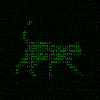

    

        
    

    <h4 align="center"><samp>¡Hola! Bienvenid@ a mi GitHub.  Soy arquitecto, hacker de BIM/VDC y desarrollador full stack obsesionado con convertir el caos en sistemas productivos y sin drama. 🔧 Experto en .NET, Python, Rust y automatización para que tus herramientas en BIM/VDC funcionen a tu favor, no en tu contra. 🌐 Explorador incansable de IA (MCP, Agentes de IA), Metaverso, Web3, Unreal Engine y XR para crear nuevas realidades aplicadas a la construcción. 🚀 Aquí no solo código, también construyo puentes entre arquitectura, ingeniería y tecnología 4.0. Si quieres optimizar modelos, hackear flujos y llevar tus proyectos al siguiente nivel, estás en el lugar correcto.☁️</samp></h4>
    

        
        
        
        
        
    

